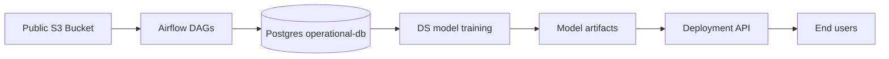
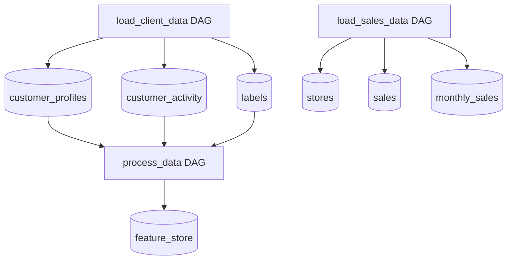
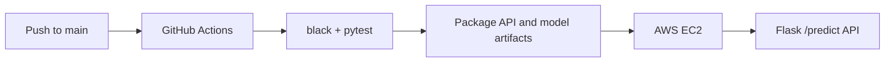
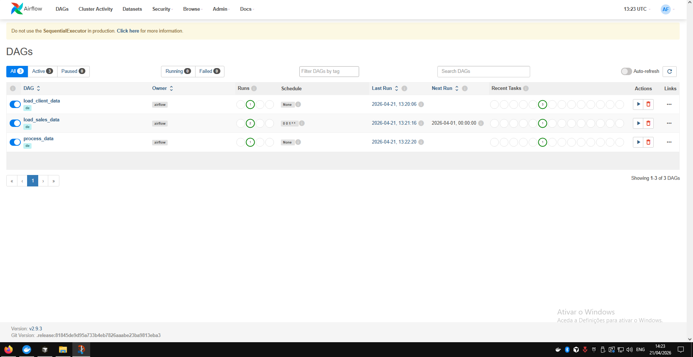
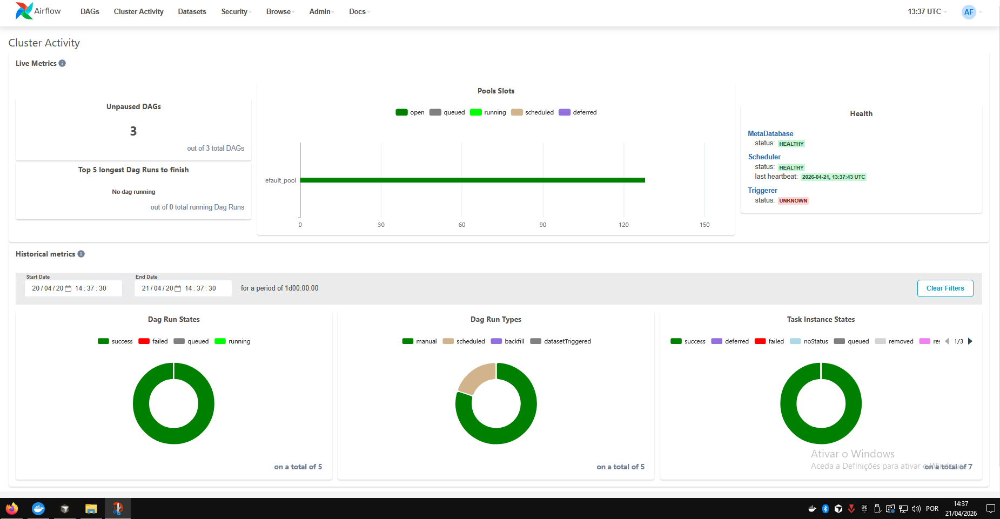
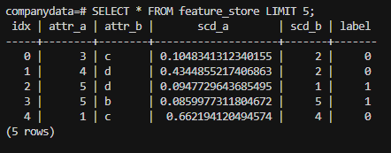
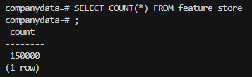
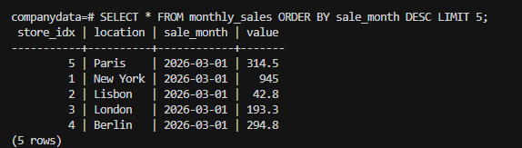

# Solution Notes

This document tracks the implementation decisions for the technical challenge as they are made.
It will be expanded as the DE, deployment, and extra-task work moves forward.

## Current Solution Direction

- The DE module uses a single Postgres container as the operational database and a single Airflow container as the workflow orchestrator.
- Airflow is intentionally kept simple: one container runs both the scheduler and the webserver, which is enough for the challenge while still providing scheduling, retries, and reruns from the UI.
- Shared ETL logic lives in a small Python package under the Airflow DAGs folder so the DAG files stay orchestration-focused.
- The deployment direction remains a single AWS EC2 instance with GitHub Actions-based CI/CD, but that work will be implemented after the DE module is stable.

## Architecture Diagrams

### High-Level System

### DE Module Flow

### Planned Deployment Flow

## Validation Screenshots

### Airflow DAGs Working

### Airflow DAG Activity

### Database Validation

## Timeline

| Date       | Task                                                         | Time Spent | Status | Notes                                                                                |
| ---------- | ------------------------------------------------------------ | ---------- | ------ | ------------------------------------------------------------------------------------ |
| 2026-04-21 | Initialize repository and create baseline `main` commit      | 0h15m      | Done   | Challenge-required clean starting point                                              |
| 2026-04-21 | Review challenge scope and module contracts                  | 0h20m      | Done   | Read root README plus DE and deployment instructions                                 |
| 2026-04-21 | Define minimal architecture for DE and deployment            | 0h25m      | Done   | Chose Airflow + Postgres, Flask + EC2 + GitHub Actions                               |
| 2026-04-21 | Implement initial DE framework                               | 1h30m      | Done   | Airflow image, SQL bootstrap, shared ETL package, DAGs                               |
| 2026-04-21 | Correct DE workflow shape and sales idempotency              | 0h25m      | Done   | Split customer DAG into explicit tasks and simplified monthly sales reload logic     |
| 2026-04-21 | Resolve container and dependency issues during DE validation | 0h30m      | Done   | Fixed Airflow Docker startup issues and pandas/SQLAlchemy compatibility problem      |
| 2026-04-21 | Stabilize Airflow scheduler metadata storage                 | 0h20m      | Done   | Moved Airflow metadata from SQLite to Postgres to avoid scheduler heartbeat failures |
| 2026-04-21 | Fix sales ETL database transaction path                      | 0h20m      | Done   | Kept delete/insert operations on the same DB connection and added step-level logging |
| 2026-04-21 | Fix DS Docker build compatibility                            | 0h15m      | Done   | Aligned DS and MLE package metadata and DS runtime with the Python version supported by auto-sklearn |
| 2026-04-21 | Fix DS runtime NumPy/Pandas binary compatibility             | 0h10m      | Done   | Restricted NumPy to `<2` so the DS container could import pandas and finish model training |
| 2026-04-21 | Implement deployment API and CI/CD foundation                | 0h45m      | Done   | Added Flask API, Docker runtime, API tests, and GitHub Actions deployment to EC2 |

## Decisions And Rationale

### Decision 1: Use Postgres exactly as the operational database defined in the challenge

- Reason: the rest of the challenge already expects `operational-db` on port `5432`, database `companydata`, and the fixed users and roles described in the DE specification.
- Impact: no cross-module contract changes are needed.

### Decision 2: Use Airflow as a minimal single-container orchestrator

- Reason: Airflow already satisfies the UI, scheduling, rerun, and backfill expectations with less custom work than building a workflow system from scratch.
- Implementation note: Airflow metadata is stored in Postgres instead of SQLite so the scheduler can run reliably in the containerized setup.

### Decision 3: Keep DAG files thin and move ETL logic into reusable classes

- Reason: this keeps orchestration separate from extraction, transformation, and loading logic.
- Impact: easier testing, less duplication, and cleaner future extension.

### Decision 4: Use unsigned reads against the public S3 bucket

- Reason: the challenge data lives in a public bucket, so the ETL should not require AWS credentials just to run locally.

### Decision 5: Keep monthly sales loading simple by deleting and reloading only the target month

- Reason: the specification requires processing only the previous month and avoiding duplicate monthly loads.
- Impact: rerunning the same Airflow task remains safe and predictable while keeping the database code easy to understand.
- Implementation note: all monthly sales delete/insert operations now run on the same SQLAlchemy connection so the task does not mix transaction-scoped deletes with separate engine-level inserts.

### Decision 6: Expose the one-off customer workflow as three explicit Airflow tasks

- Reason: the challenge describes a workflow that fetches the customer-related files individually, and the Airflow UI is clearer when each file load is visible as its own task.
- Impact: reviewers can inspect task-level behavior directly in the DAG graph instead of seeing one opaque loader task.

### Decision 7: Deploy the model behind a minimal Flask API on a single EC2 instance

- Reason: one Dockerized Flask service on EC2 is the simplest approach that still satisfies the internet-access requirement and keeps the deployment easy to explain.
- Impact: the production path stays small, with one API service, one public endpoint, and no extra orchestration layers.

### Decision 8: Use GitHub Actions to validate and deploy API code plus committed model artifacts

- Reason: the challenge requires automatic deployment on pushes to `main`, while the trained model is produced locally and then shipped as an artifact.
- Impact: the workflow runs `black` and `pytest`, copies the deployment bundle to EC2 over SSH, and rebuilds the API service there.

## Problems Faced

### Docker build permission error in the Airflow image

- Problem: the Airflow Docker build failed when running `chmod +x /opt/airflow/scripts/start-airflow.sh`.
- Cause: the image was trying to execute `chmod` while the active user did not have the required permissions.
- Resolution: the Dockerfile was updated to switch to `root` before copying and changing permissions on the startup script, then switch back to the `airflow` user for runtime.
- Outcome: the Airflow image built successfully and the startup script could be executed correctly.

### Airflow startup failed because the script path was treated as an Airflow CLI command

- Problem: the container started, but Airflow rejected `/opt/airflow/scripts/start-airflow.sh` as an invalid command.
- Cause: the base Airflow image entrypoint was still active, so the custom script path was passed into the `airflow` command instead of being executed directly.
- Resolution: the image entrypoint was updated to run the shell script directly, and the internal webserver port was aligned with the Docker Compose port mapping.
- Outcome: the Airflow webserver became reachable on `localhost:8082`.

### pandas and SQLAlchemy compatibility error during DAG execution

- Problem: the customer-load DAG failed with `AttributeError: 'Engine' object has no attribute 'cursor'` and later `AttributeError: 'Connection' object has no attribute 'cursor'`.
- Cause: `pandas==2.2.2` was incompatible with the SQLAlchemy 1.4 stack used by the Airflow image in this setup.
- Resolution: the Airflow image dependencies were adjusted to use `pandas==2.1.4`, and the database helper code was kept on the simpler engine-based pandas SQL calls.
- Outcome: the database write path became compatible with the Airflow container runtime again.

### Airflow scheduler heartbeat failure caused by SQLite metadata storage

- Problem: the Airflow UI reported that the scheduler was not running, and `airflow jobs check --job-type SchedulerJob --local` returned `No alive jobs found`.
- Cause: Airflow was still using the default SQLite metadata database (`sqlite:////opt/airflow/airflow.db`), which proved unstable for the scheduler/webserver setup in the container.
- Resolution: Airflow was configured to use the existing Postgres service as its metadata database via `AIRFLOW__DATABASE__SQL_ALCHEMY_CONN`.
- Outcome: the scheduler state is now persisted in Postgres instead of a local SQLite file, which is a more stable setup for running DAGs in this environment.

### Monthly sales DAG stalled after S3 reads

- Problem: the `load_sales_data` task logged successful S3 fetches and then appeared to hang without completing.
- Cause: the database layer was mixing one transaction-bound SQLAlchemy connection for the monthly deletes with separate engine-level pandas `to_sql()` inserts, which made the sales write path inconsistent and harder to diagnose.
- Resolution: the sales-month delete and insert operations were updated to use the same DB connection, and step-level logging was added around the sales ETL flow.
- Outcome: the task now has a consistent transaction path and clearer runtime logs for validation and debugging.

### DS Docker build failed during `pip install /ds/ds_package`

- Problem: the DS image build failed at the package installation step, first surfacing as missing runtime dependencies and then as incompatibility around the model-training dependency stack.
- Cause: the installable package metadata was incomplete in `pyproject.toml`, and the DS image was using Python 3.10 while `auto-sklearn==0.14.7` is aligned with Python 3.9-era support.
- Resolution: runtime dependencies were declared in `pyproject.toml`, and the DS image plus DS/MLE package Python constraints were aligned to Python 3.9.
- Outcome: the DS image now matches the expected dependency stack and can proceed past package installation when rebuilt.

### DS runtime failed with NumPy/Pandas binary incompatibility

- Problem: after the DS image built successfully, the `model-training` container failed at runtime with `ValueError: numpy.dtype size changed, may indicate binary incompatibility`.
- Cause: the environment resolved a NumPy version that was too new for the pinned `pandas==1.4.4`, which caused a binary ABI mismatch during import.
- Resolution: `numpy<2` was added to the DS and MLE package dependencies so the installed NumPy version stays compatible with the older pandas version used in the project.
- Outcome: the DS container could import the training code successfully and the model artifacts were saved.
