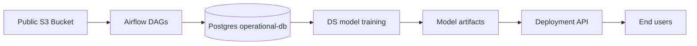
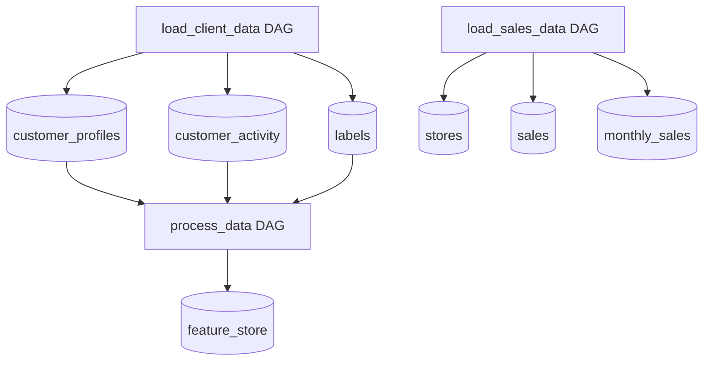
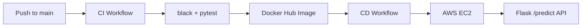

# Solution Notes

This document tracks the implementation decisions for the technical challenge as they are made.
It will be expanded as the DE, deployment, and extra-task work moves forward.

## Current Solution Direction

- The DE module uses a single Postgres container as the operational database and a single Airflow container as the workflow orchestrator.
- Airflow is intentionally kept simple: one container runs both the scheduler and the webserver, which is enough for the challenge while still providing scheduling, retries, and reruns from the UI.
- Shared ETL logic lives in a small Python package under the Airflow DAGs folder so the DAG files stay orchestration-focused.
- The deployment direction is a single AWS EC2 instance pulling immutable Docker Hub images, with GitHub Actions split into separate CI and CD workflows.

---

## Architecture Diagrams

### High-Level System




---

### DE Module Flow




---

### Planned Deployment Flow




---

The `screenshots` folder in the project root contains proof that the solution is working end to end, including successful Airflow runs, database validation, GitHub Actions executions, and the deployed API responding correctly.

## Timeline


| Date       | Task                                                         | Time Spent | Status | Notes                                                                                                               |
| ---------- | ------------------------------------------------------------ | ---------- | ------ | ------------------------------------------------------------------------------------------------------------------- |
| 2026-04-21 | Initialize repository and create baseline `main` commit      | 0h15m      | Done   | Challenge-required clean starting point                                                                             |
| 2026-04-21 | Review challenge scope and module contracts                  | 0h20m      | Done   | Read root README plus DE and deployment instructions                                                                |
| 2026-04-21 | Define minimal architecture for DE and deployment            | 0h25m      | Done   | Chose Airflow + Postgres, Flask + EC2 + GitHub Actions                                                              |
| 2026-04-21 | Implement initial DE framework                               | 1h30m      | Done   | Airflow image, SQL bootstrap, shared ETL package, DAGs                                                              |
| 2026-04-21 | Correct DE workflow shape and sales idempotency              | 0h25m      | Done   | Split customer DAG into explicit tasks and simplified monthly sales reload logic                                    |
| 2026-04-21 | Resolve container and dependency issues during DE validation | 0h30m      | Done   | Fixed Airflow Docker startup issues and pandas/SQLAlchemy compatibility problem                                     |
| 2026-04-21 | Stabilize Airflow scheduler metadata storage                 | 0h20m      | Done   | Moved Airflow metadata from SQLite to Postgres to avoid scheduler heartbeat failures                                |
| 2026-04-21 | Fix sales ETL database transaction path                      | 0h20m      | Done   | Kept delete/insert operations on the same DB connection and added step-level logging                                |
| 2026-04-21 | Fix DS Docker build compatibility                            | 0h15m      | Done   | Aligned DS and MLE package metadata and DS runtime with the Python version supported by auto-sklearn                |
| 2026-04-21 | Fix DS runtime NumPy/Pandas binary compatibility             | 0h15m      | Done   | Restricted NumPy to `<2` so the DS container could import pandas and finish model training                          |
| 2026-04-21 | Implement DS extra task for dynamic model artifact naming    | 0h15m      | Done   | Saved timestamped model/OHE artifacts and made model loading pick the latest matching pair by default               |
| 2026-04-21 | Implement MLE extra task for base-model logging              | 0h10m      | Done   | Added lightweight logging around prediction and prediction-storage writes in `MLEModel`                             |
| 2026-04-21 | Implement deployment API and CI/CD foundation                | 1h00m      | Done   | Added Flask API, Docker runtime, API tests, and GitHub Actions deployment to EC2                                    |
| 2026-04-21 | Refactor deployment to immutable image CI/CD                 | 0h45m      | Done   | Split CI and CD workflows, switched EC2 runtime to Docker Hub image pulls, and prepared runtime env config          |
| 2026-04-22 | Create remote repositories and deployment infrastructure     | 0h20m      | Done   | Created the GitHub repository, private Docker Hub repository, and AWS EC2 instance for the deployment flow          |
| 2026-04-22 | Prepare EC2 runtime and GitHub secrets                       | 0h30m      | Done   | Installed Docker on EC2, created deployment folders, copied runtime compose file, and added repository secrets      |
| 2026-04-22 | Validate public deployment access                            | 0h15m      | Done   | Added the custom TCP port rule for `5000` to the EC2 security group and validated remote requests to `/predict`     |
| 2026-04-22 | Harden EC2 deployment against disk exhaustion                | 0h10m      | Done   | Moved Docker cleanup before image pull and added disk-usage diagnostics to prevent `no space left on device` errors |


---

## Decisions And Rationale

### Decision 1: Use Postgres exactly as the operational database defined in the challenge

- Reason: the rest of the challenge already expects `operational-db` on port `5432`, database `companydata`, and the fixed users and roles described in the DE specification.
- Impact: no cross-module contract changes are needed.

### Decision 2: Use Airflow as a minimal single-container orchestrator

- Reason: Airflow already satisfies the UI, scheduling, rerun, and backfill expectations with less custom work than building a workflow system from scratch.
- Implementation note: Airflow metadata is stored in Postgres instead of SQLite so the scheduler can run reliably in the containerized setup.

### Decision 3: Keep DAG files thin and move ETL logic into reusable classes

- Reason: this keeps orchestration separate from extraction, transformation, and loading logic.
- Impact: easier testing, less duplication, and cleaner future extension.

### Decision 4: Use unsigned reads against the public S3 bucket

- Reason: the challenge data lives in a public bucket, so the ETL should not require AWS credentials just to run locally.

### Decision 5: Keep monthly sales loading simple by deleting and reloading only the target month

- Reason: the specification requires processing only the previous month and avoiding duplicate monthly loads.
- Impact: rerunning the same Airflow task remains safe and predictable while keeping the database code easy to understand.
- Implementation note: all monthly sales delete/insert operations now run on the same SQLAlchemy connection so the task does not mix transaction-scoped deletes with separate engine-level inserts.

### Decision 6: Expose the one-off customer workflow as three explicit Airflow tasks

- Reason: the challenge describes a workflow that fetches the customer-related files individually, and the Airflow UI is clearer when each file load is visible as its own task.
- Impact: reviewers can inspect task-level behavior directly in the DAG graph instead of seeing one opaque loader task.

### Decision 7: Save DS artifacts with timestamped filenames and load the latest by default

- Reason: the extra task explicitly asks for dynamic model naming by timestamp while keeping deployment usage simple.
- How it was made: `SimpleModel.save()` was updated to create `model_<timestamp>.pkl` and `one_hot_encoder_<timestamp>.pkl`, and `SimpleModel.load()` now scans the model folder, picks the latest matching pair, and still falls back to the legacy static filenames if needed.
- Impact: multiple training runs can coexist in the same model directory without overwriting each other, and the deployment code can keep calling `load(model_folder)` without extra parameters.

### Decision 8: Add lightweight logging to the shared MLE base class

- Reason: the MLE extra task is small and is best handled centrally so every derived model benefits without duplicated code.
- How it was made: the `MLEModel` class now uses the standard library `logging` module with a file handler targeting `~/mle_storage/logging/mle.log`, and logs when a prediction starts, when it is persisted, and when the storage directory is missing.
- Impact: prediction flow is easier to observe during runtime, logs persist in the same mounted runtime storage as predictions, and the existing public API and prediction-record storage behavior stay unchanged.

### Decision 9: Deploy the model behind a minimal Flask API on a single EC2 instance

- Reason: one Dockerized Flask service on EC2 is the simplest approach that still satisfies the internet-access requirement and keeps the deployment easy to explain.
- Impact: the production path stays small, with one API service, one public endpoint, and no extra orchestration layers.

### Decision 10: Use GitHub Actions to validate and deploy API code plus committed model artifacts

- Reason: the challenge requires automatic deployment on pushes to `main`, while the trained model artifacts are part of the released deployment image.
- Impact: GitHub Actions now validates the deployment code, publishes the image, and then triggers a separate EC2 deployment workflow.

### Decision 11: Split deployment into separate CI and CD workflows

- Reason: separating image build/publish from EC2 rollout gives clearer responsibilities, faster deployments, and a more production-like release flow.
- Impact: CI now produces a tagged Docker image in Docker Hub, and CD only pulls a specific image tag onto EC2 and restarts the service.

### Decision 12: Deploy immutable Docker Hub images by commit SHA

- Reason: SHA-tagged images are traceable and easy to roll back compared with rebuilding source directly on the server.
- Impact: EC2 runtime configuration is now image-based and uses `IMAGE_TAG=sha-<commit>` during deployment.

---

## Deployment Runbook

### External services created

- Created a GitHub repository to host the challenge solution and GitHub Actions workflows.
- Created a private Docker Hub repository to store the deployment image produced by CI.
- Created an AWS EC2 Ubuntu instance to run the deployed prediction API.

### EC2 instance setup

- Connected to the instance over SSH using the downloaded key pair and the `ubuntu` user.
- Updated the instance packages.
- Installed Docker Engine and the Docker Compose plugin.
- Created the runtime folder structure:
  - `~/daredata-challenge/modules/deployment`
  - `~/daredata-challenge/modules/deployment/storage`
- Copied the runtime deployment file `modules/deployment/docker-compose.yml` to the instance.
- Logged in to Docker Hub from the instance so the server could pull the private deployment image.

### GitHub repository secrets created

- Docker Hub:
  - `DOCKERHUB_USERNAME`
  - `DOCKERHUB_TOKEN`
  - `DOCKERHUB_IMAGE`
- EC2:
  - `EC2_HOST`
  - `EC2_USER`
  - `EC2_SSH_PRIVATE_KEY`

### Network configuration required

- Added an inbound EC2 security-group rule for SSH on port `22` from the development machine IP.
- Added an inbound `Custom TCP` rule on port `5000` so the deployed API could be reached from outside the instance.
- This final rule was necessary for requests from the local machine to reach `/predict`.

### Deployment validation sequence

- Pushed the working branch to GitHub and ran the CI workflow to build, test, and publish the image to Docker Hub.
- Triggered the CD workflow to connect to EC2, write the runtime `.env`, pull the SHA-tagged image, and restart the API service.
- Validated the deployment on the server with local `curl` requests.
- Validated the deployment externally by sending a request from the local machine to the EC2 public IP on port `5000`.
- Added pre-pull Docker cleanup and disk-usage diagnostics after hitting an EC2 disk-space error during repeated deployments.
- Here is the EC2 instance url to make predictions via the API: 
  ```python
  http://16.171.198.135:5000/predict
  ```

---

## Problems Faced

### Docker build permission error in the Airflow image

- Problem: the Airflow Docker build failed when running `chmod +x /opt/airflow/scripts/start-airflow.sh`.
- Cause: the image was trying to execute `chmod` while the active user did not have the required permissions.
- Resolution: the Dockerfile was updated to switch to `root` before copying and changing permissions on the startup script, then switch back to the `airflow` user for runtime.
- Outcome: the Airflow image built successfully and the startup script could be executed correctly.

### Airflow startup failed because the script path was treated as an Airflow CLI command

- Problem: the container started, but Airflow rejected `/opt/airflow/scripts/start-airflow.sh` as an invalid command.
- Cause: the base Airflow image entrypoint was still active, so the custom script path was passed into the `airflow` command instead of being executed directly.
- Resolution: the image entrypoint was updated to run the shell script directly, and the internal webserver port was aligned with the Docker Compose port mapping.
- Outcome: the Airflow webserver became reachable on `localhost:8082`.

### pandas and SQLAlchemy compatibility error during DAG execution

- Problem: the customer-load DAG failed with `AttributeError: 'Engine' object has no attribute 'cursor'` and later `AttributeError: 'Connection' object has no attribute 'cursor'`.
- Cause: `pandas==2.2.2` was incompatible with the SQLAlchemy 1.4 stack used by the Airflow image in this setup.
- Resolution: the Airflow image dependencies were adjusted to use `pandas==2.1.4`, and the database helper code was kept on the simpler engine-based pandas SQL calls.
- Outcome: the database write path became compatible with the Airflow container runtime again.

### Airflow scheduler heartbeat failure caused by SQLite metadata storage

- Problem: the Airflow UI reported that the scheduler was not running, and `airflow jobs check --job-type SchedulerJob --local` returned `No alive jobs found`.
- Cause: Airflow was still using the default SQLite metadata database (`sqlite:////opt/airflow/airflow.db`), which proved unstable for the scheduler/webserver setup in the container.
- Resolution: Airflow was configured to use the existing Postgres service as its metadata database via `AIRFLOW__DATABASE__SQL_ALCHEMY_CONN`.
- Outcome: the scheduler state is now persisted in Postgres instead of a local SQLite file, which is a more stable setup for running DAGs in this environment.

### Monthly sales DAG stalled after S3 reads

- Problem: the `load_sales_data` task logged successful S3 fetches and then appeared to hang without completing.
- Cause: the database layer was mixing one transaction-bound SQLAlchemy connection for the monthly deletes with separate engine-level pandas `to_sql()` inserts, which made the sales write path inconsistent and harder to diagnose.
- Resolution: the sales-month delete and insert operations were updated to use the same DB connection, and step-level logging was added around the sales ETL flow.
- Outcome: the task now has a consistent transaction path and clearer runtime logs for validation and debugging.

### DS Docker build failed during `pip install /ds/ds_package`

- Problem: the DS image build failed at the package installation step, first surfacing as missing runtime dependencies and then as incompatibility around the model-training dependency stack.
- Cause: the installable package metadata was incomplete in `pyproject.toml`, and the DS image was using Python 3.10 while `auto-sklearn==0.14.7` is aligned with Python 3.9-era support.
- Resolution: runtime dependencies were declared in `pyproject.toml`, and the DS image plus DS/MLE package Python constraints were aligned to Python 3.9.
- Outcome: the DS image now matches the expected dependency stack and can proceed past package installation when rebuilt.

### DS runtime failed with NumPy/Pandas binary incompatibility

- Problem: after the DS image built successfully, the `model-training` container failed at runtime with `ValueError: numpy.dtype size changed, may indicate binary incompatibility`.
- Cause: the environment resolved a NumPy version that was too new for the pinned `pandas==1.4.4`, which caused a binary ABI mismatch during import.
- Resolution: `numpy<2` was added to the DS and MLE package dependencies so the installed NumPy version stays compatible with the older pandas version used in the project.
- Outcome: the DS container could import the training code successfully and the model artifacts were saved.

### Deployment workflow was too tightly coupled to source-copy rebuilds

- Problem: the first deployment workflow rebuilt the application source directly on EC2, which mixed CI and CD concerns and made releases less traceable.
- Cause: the initial implementation copied project files to the server and ran `docker compose up -d --build` remotely.
- Resolution: the deployment was refactored into two workflows: CI builds/tests and pushes a Docker image to Docker Hub, while CD pulls the specific SHA-tagged image on EC2 and restarts the service.
- Outcome: the release flow is now closer to production practice and simpler server-side deployment steps.

### EC2 deployment failed with `no space left on device`

- Problem: a repeated deployment failed during the EC2 rollout phase because the host ran out of disk space before the new image finished pulling.
- Cause: the workflow was pruning Docker images only after the new image had already been downloaded, which is too late on a small EC2 instance.
- Resolution: the EC2 deploy workflow was updated to run container/image/builder cleanup and disk-usage diagnostics before `docker compose pull`.
- Outcome: the deployment host now frees disk space before downloading a new SHA-tagged image, which reduces the chance of repeated rollout failures.
